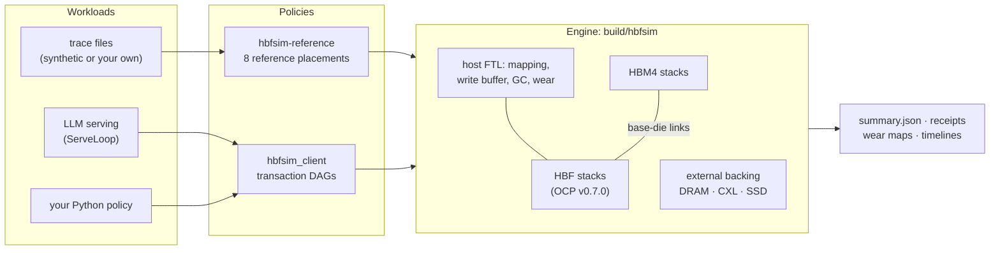

# HBFSim

> Status: Current
> Last reviewed: 2026-09-29

**A simulator and playground for High-Bandwidth Flash (HBF) memory systems in AI.**

[](https://github.com/FlashLab-MBZUAI/HBFSim/actions/workflows/ci.yml)
[](LICENSE)


[Quick start](#quick-start) ·
[What you can explore](#what-you-can-explore) ·
[Examples](examples/README.md) ·
[Getting started](docs/getting-started.md) ·
[Documentation](docs/README.md) ·
[Contributing](CONTRIBUTING.md) ·
[中文](README.zh-CN.md)

HBF stacks NAND flash the way HBM stacks DRAM: it sits next to the
accelerator with HBM-class bandwidth and many times HBM's capacity — but it
reads in microseconds, writes in pages, erases in blocks, and wears out.
Whether that trade pays off depends on where data lives, how flash is
managed, and what the workload does. HBFSim lets you ask those questions.

It models HBM4, HBF (following the OCP HBF v0.7.0 specification) with a
host-managed flash translation layer, the links between them, and external
backing memory (host DRAM, CXL, LPDDR, NVMe, CXL-SSD) as **one causal
event-driven system**: timing, capacity, placement, data movement, mapping,
garbage collection, write amplification and wear. Every result records the
source revision, configuration, executable and workload that produced it.

## Quick start

You need CMake 3.20+, a C++20 compiler (tested with GCC 13, Clang 18 and
Apple Clang 15) and Python 3.10+. No Python packages are required.

```bash
git clone https://github.com/FlashLab-MBZUAI/HBFSim.git
cd HBFSim
python3 -m hbfsim doctor        # check the toolchain
python3 -m hbfsim quickstart    # build (about a minute, once) and run a first comparison
```

`quickstart` replays a small LLM-like memory trace (weights, KV cache,
scratch) on a server with 4 HBM stacks and 4 HBF stacks under five placement
policies:

```text
scenario       makespan (us)  throughput (GB/s)  mean lat (us)  p95 lat (us)  HBM ops  HBF ops  HBF WAF
-------------  -------------  -----------------  -------------  ------------  -------  -------  -------
all-hbm                3.383              36.32         0.4029         1.194    1,920        0        -
all-hbf                5,177             0.1198          276.6         927.8        0    1,920    3.667
flat                   4,161              13.64          2.444         6.786    1,024      896    3.667
direct-read            2,049            0.05998          547.4         1,855      896    1,024        -
hbf-streaming          2,195              2.821           26.3         40.58    1,964       44     1.25
```

It then explains every column and suggests next steps. Prefer a container?
Open the repository in a [dev container or GitHub Codespace](.devcontainer/devcontainer.json);
it builds everything on creation.

## What you can explore

| Question | Start with |
| --- | --- |
| How far is HBF from HBM, and which hybrid placement closes the gap? | `python3 -m hbfsim quickstart`, [example 1](examples/01_first_comparison.py) |
| Is read bandwidth limited by the HBF interface grade or by the NAND array? | [example 3](examples/03_read_bandwidth_ceiling.py) |
| What do flash-translation mapping strategies cost in latency, WAF and wear? | [example 2](examples/02_ftl_mapping_tradeoffs.py) |
| How much lifetime does wear leveling buy, and what does it cost? | [design-space recipes](docs/guides/design-space.md#wear-leveling-versus-write-amplification) |
| Is HBF a better capacity tier than host DRAM, CXL or an SSD? | [example 6](examples/06_capacity_tier_media.py) |
| Does *my* caching or migration policy help? | [example 5](examples/05_custom_policy.py): a policy in ~60 lines of Python |
| How do placements behave on *my* workload? | [example 4](examples/04_custom_trace.py), or LLM serving through [ServeLoop](#simulating-llm-serving) |

Every knob is a configuration key, so exploring is usually one command:

```bash
python3 -m hbfsim list systems            # hardware profiles, overlays, scenarios, metrics
python3 -m hbfsim run --system server-hbm128-hbf1024 --overlay ocp-v070-grade1 --set hbf-read-ns=8000
python3 -m hbfsim sweep --vary hbf-read-ns=2000,4000,8000 --vary overlay=ocp-v070-grade1,ocp-v070-grade2
python3 -m hbfsim show out/run-*/         # tabulate earlier runs side by side
```

The [design-space recipes](docs/guides/design-space.md) collect verified
commands for common HBF questions, including which ones need a heavier
workload than the built-in smoke trace.

## How it works



The engine is **semantic-free**: it executes transactions — "read 4 KiB from
HBF at time t after transaction x completes" — on per-resource calendars, and
knows nothing about models or policies. Placement, caching, migration and
prefetch live above it, so a new idea never changes the physical model.

Two programs are built:

- `build/hbfsim` — the engine. It reads transaction-DAG batches on stdin and
  returns causal completion receipts; Python drives it through
  [`hbfsim_client`](hbfsim_client/README.md) or `hbfsim.open_session`.
- `build/hbfsim-reference` — replays address traces through a maintained
  suite of reference policies:

| Scenario | Behavior |
| --- | --- |
| `all-hbm` | Route every request to HBM |
| `all-hbf` | Route every request through the logical HBF path |
| `flat` | Split one address space at a configured HBM boundary |
| `direct-read` | Serve eligible reads from static physical HBF while writes remain in HBM |
| `hbf-streaming` | Double-buffer layers from HBF into HBM |
| `external-streaming` | Double-buffer layers from an external backing model into HBM |
| `demand-fill` | Behavior-only baseline that admits every observed page to HBM |
| `reuse-filtered` | Behavior-only policy that promotes a page only after observed reuse |

These are examples, not the simulator's policy universe. The
[concepts guide](docs/concepts.md) explains the model, the glossary and how a
run flows end to end.

## Using the programs directly

`python3 -m hbfsim` is a thin front door: each run directory contains
`command.txt` with the exact simulator command, so everything is reproducible
without Python. The equivalent of the quick start by hand:

```bash
cmake -S . -B build -DCMAKE_BUILD_TYPE=Release
cmake --build build --parallel
mkdir -p out/quickstart
./build/hbfsim-reference \
  --generate-semantic-llm out/quickstart/trace.txt \
  --llm-tokens 4 \
  --llm-layers 2

./build/hbfsim-reference \
  --config configs/systems/server-hbm128-hbf512.cfg \
  --config configs/policies/reference/server-hbm128-hbf512.cfg \
  --trace out/quickstart/trace.txt \
  --scenarios all-hbm,all-hbf,flat,direct-read,hbf-streaming \
  --summary-json out/quickstart/summary.json
```

The second command completes with `SANITY: PASS`; the generated trace
reaches both sides of the default 512 MiB `flat` boundary. Do not add
`--max-ops 128` to this example: that prefix contains only low-address
weight requests and therefore cannot validate mixed HBM/HBF routing.

Configuration is layered: one complete system profile from
`configs/systems/`, then optional overlays from `configs/overlays/`, then
command-line `--KEY VALUE` overrides; later values win. The
[configuration catalog](configs/README.md) explains every profile and key,
and `configs/parameter-provenance.json` records the source and evidence grade
of every physical default. The summary JSON
schema is `hbfsim.simulation.summary` version 19; `hbfsim.load_summary`
reads it into Python.

With the build configured by the commands above (tests are on by default),
`ctest --test-dir build --output-on-failure` runs the test suite, including
every example.

## Simulating LLM serving

[ServeLoop](https://github.com/FlashLab-MBZUAI/ServeLoop) is the
companion frontend that turns model descriptors and request streams into
continuous-batching iterations, paged-KV lifecycles and byte-exact memory
transactions, and closes the loop with HBFSim's completion times. ServeLoop's
Python package and console command are named `hbserve`:

```bash
git clone https://github.com/FlashLab-MBZUAI/ServeLoop.git ../ServeLoop
export PYTHONPATH="../ServeLoop:$PWD${PYTHONPATH:+:$PYTHONPATH}"
python3 -B -m hbserve run \
  --model ../ServeLoop/models/llama31-8b-w8-kv-bf16.json \
  --system configs/systems/miniquick/4hbm-4hbf.cfg \
  --requests ../ServeLoop/examples/quickstart-requests.json \
  --simulator build/hbfsim \
  --placement weights-hbf-kv-hbm \
  --out out/quickstart-serving
```

This synthetic eight-request example uses 256-token prompts and 32 output
tokens. Its timings depend on the declared compute assumptions and are not
calibrated hardware predictions. The [ServeLoop guide](docs/guides/serveloop.md)
covers setup, what crosses the engine boundary, and the limits of a serving run.

## Trustworthy by construction

HBFSim treats evidence discipline as a feature, so exploratory numbers are
never mistaken for measured claims:

- **Provenance on every result** — source commit and dirty flag, resolved
  configuration, executable digest and trace digest travel with each summary.
- **Graded parameters** — every physical default carries an evidence grade
  (standard- or vendor-published, literature-derived, measured, or an
  exploratory assumption) in the [provenance registry](configs/parameter-provenance.json);
  A100 and H200 measurements calibrate named host-DRAM and NVMe overlays.
- **Fail-closed inputs** — impossible capacities, overflowing ranges and
  inconsistent timings are rejected instead of producing plausible numbers,
  and the runner flags results whose interpretation needs care.
- **Executable verification** — contracts, independent oracles, property
  fuzzing, analytical bounds and mutation testing run as CTest gates and
  `verify_*` targets; see the [verification framework](verification/README.md)
  and the [coverage map](docs/verification/coverage.md).

HBFSim is a transaction-level research simulator: it follows the public OCP
HBF v0.7.0 and JEDEC HBM4 organization, but it is not a vendor product model,
an electrical or protocol-conformance implementation, or a substitute for
hardware calibration. The [model reference](docs/reference/model.md) and
[evidence policy](docs/reference/evidence-policy.md) state exactly what is and
is not modeled.

## Repository map

| You want to… | Look in |
| --- | --- |
| Run and explore | [`hbfsim/`](hbfsim/README.md) front door, [`examples/`](examples/README.md), [`configs/`](configs/README.md) |
| Bring workloads | [`workloads/`](workloads/README.md) trace generation, locality analysis and quality checks |
| Write policies and frontends | [`hbfsim_client/`](hbfsim_client/README.md) transaction protocol, [`src/policies/`](src/README.md) reference policies |
| Understand or change the model | [`src/physical/`, `src/host/`](src/README.md), [`docs/reference/`](docs/README.md#reference) |
| Check correctness | [`tests/`](tests/README.md), [`verification/`](verification/README.md) |
| See what backs a number | [`configs/parameter-provenance.json`](configs/parameter-provenance.json), [`evidence/`](evidence/README.md) |
| Analyze results | [`reports/`](reports/README.md) |

The [project layout](docs/project-layout.md) states each directory's
responsibility.

## Contributing

Contributions of every size are welcome: a new configuration overlay, an
example, a workload importer, a policy, a documentation fix, or a study you
ran. [CONTRIBUTING.md](CONTRIBUTING.md) explains how to get set up and what a
change to the physical model needs, and the
[extending guide](docs/guides/extending.md) shows where each kind of change
belongs. Please follow the [Code of Conduct](CODE_OF_CONDUCT.md).

If HBFSim helps your research, please cite it using [CITATION.cff](CITATION.cff).

## License

HBFSim is distributed under the [MIT License](LICENSE).
