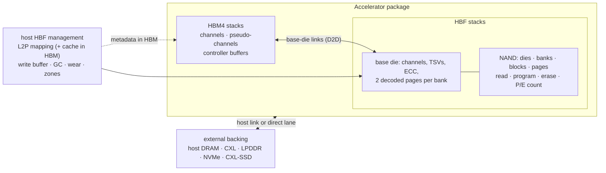

# Concepts

> Status: Current
> Last reviewed: 2026-09-29

This page is the minimum background for using HBFSim well: what HBF is, what
the simulator models, how a run flows, and the vocabulary used everywhere
else. The [model reference](reference/model.md) has the precise contracts.

## HBF in one page

High-Bandwidth Flash stacks NAND flash dies on a base die with through-silicon
vias, like HBM stacks DRAM, and attaches the stack to the processor package.
The [OCP HBF v0.7.0 specification](https://www.opencompute.org/documents/ocp-hbf-architecture-specification-v0-7-0-final-pdf)
defines its interface in three speed grades:

| Grade | Channels per stack | Payload per channel | Maximum payload per stack |
| --- | ---: | ---: | ---: |
| 1 | 8 | 48 GB/s | 384 GB/s |
| 2 | 16 | 96 GB/s | 1536 GB/s |
| 3 | 16 | 192 GB/s | 3072 GB/s |

Compared with HBM, a stack holds many times more bytes, but flash behaves
differently in ways that decide whether it is useful as memory:

- **Reads are page-sized and slow to start.** A read senses a whole 4 KiB page
  from the NAND array in microseconds (`hbf-read-ns`, 4 µs in the shipped
  profiles) versus tens of nanoseconds for DRAM. Bandwidth comes from reading
  many banks in parallel, so the array can be the ceiling before the interface
  is.
- **Writes append; erases are coarse.** Pages are programmed in order within a
  block (`hbf-program-ns`, 75 µs) and a block must be erased before reuse.
  Updating data in place is impossible, so a **flash translation layer (FTL)**
  maps logical pages to physical pages and a **garbage collector (GC)**
  copies still-valid pages out of blocks it wants to erase.
- **Flash wears out.** Each block survives a limited number of program/erase
  (P/E) cycles. GC copies add writes (**write amplification**), and **wear
  leveling** spreads erases at the cost of more copies.
- **Management lives on the host.** In OCP HBF the host owns mapping, write
  buffering, GC and wear policy; the device owns its channel-zone layout and
  physical erase counts. Mapping tables and write buffers occupy HBM, and GC
  copies travel through the same device interface as application data.

These properties make placement the central question: immutable, streamed
data such as model weights suits flash; small, hot, frequently updated data
such as a growing KV cache stresses it. HBFSim exists to measure those
trade-offs under real workloads instead of guessing them.

## What is modeled

- **HBM4** follows the public JESD270-4 organization (32 channels, two
  pseudo-channels each, 8 Gb/s per pin) with an aggregate channel timing model
  and shared controller-buffer contention; there are no per-command
  ACT/PRE/refresh events.
- **HBF** follows OCP HBF v0.7.0: per-channel command/receive/transmit
  calendars, banks with one sense resource and two decoded page slots,
  sequential programming with automatic erase, ECC and internal data paths,
  and an optional thermal governor.
- **Host management** provides page, entry, compressed, block, extent and
  hybrid mapping organizations, fully resident or cached in HBM; coalescing
  write buffers; GC with watermarks and wear-leveling weight; zones and
  persistent images for checkpoint/restart.
- **External backing** is one request/controller/media pipeline configured as
  host DRAM, CXL memory, on-package LPDDR, NVMe SSD or a CXL-SSD with an
  optional device-side DRAM cache.

Every resource keeps a calendar of when it is busy, so contention, queueing
and overlap emerge from the transactions rather than from formulas.

### Standards followed, and where the model stops

The [130-page OCP HBF v0.7.0 specification](https://www.opencompute.org/documents/ocp-hbf-architecture-specification-v0-7-0-final-pdf)
is the HBF reference. Channels have independent receive/transmit calendars,
two decoded pages are retained per bank, and NAND programs append whole 4 KiB
pages with automatic erase on page zero. Mapping, GC, write buffering and wear
policy belong to the host; the device owns its channel-zone permutation and
physical P/E counts and has no GC or copyback path. GC copies consume HBF
reads, finite copy slots reserved in HBM, HBM traffic and HBF writes. Host
reclaim and zone reset do not themselves increment physical erase counts.
Controller storage is deducted from application HBM capacity and its
transfers share the HBM channel calendars; no additional shared host-DRAM
payload port is assumed.

HBM defaults follow the public JEDEC HBM4 JESD270-4 organization at 8 Gb/s per
pin, with approximate access latency and effective channel bandwidth. The HBF
grade does not select an HBM generation. HBFSim is a transaction simulator,
not electrical or packet-level conformance; the [model reference](reference/model.md)
lists the remaining limits.

## How a run flows

1. **A workload** describes what the application touches: a trace file, a
   synthetic pattern, or LLM-serving iterations from ServeLoop.
2. **A policy** decides where each access goes: HBM, HBF through the FTL,
   static flash, an external device, or a copy between them. Reference
   policies live in `hbfsim-reference`; your own can be Python.
3. **Transactions** reach the engine with a target, address, size, issue time
   and dependencies. The engine reserves every resource on the path and
   returns when each transaction completed.
4. **Receipts** accumulate into a summary: per-device statistics, time
   breakdowns, write amplification, wear, and the provenance of all inputs.

Because the engine is semantic-free, the same physical model serves the
reference suite, ServeLoop and your prototypes.

## Two programs, three Python layers

| Component | Role |
| --- | --- |
| `build/hbfsim` | The engine: a persistent session that executes transaction DAGs from stdin |
| `build/hbfsim-reference` | Trace replay through eight reference placement policies, with summary JSON |
| `hbfsim` (Python) | The front door: build, list, run, sweep, show; `hbfsim.open_session` for policies |
| `hbfsim_client` (Python) | The validated transaction protocol and session client used by every frontend |
| ServeLoop (separate repository) | LLM-serving workload compiler that drives the engine in closed loop |

## Transaction targets

| Target | Meaning |
| --- | --- |
| `HBM` | HBM application memory |
| `HBF_LOGICAL` | HBF through the host FTL (mapping, write buffer, GC) |
| `HBF_STATIC` | Immutable data at a fixed physical flash location, bypassing the FTL |
| `HBF_PHYSICAL` | Raw physical flash pages for explicitly managed layouts |
| `D2D_HBF_TO_HBM`, `D2D_HBM_TO_HBF` | Copies over a stack's base-die link |
| `EXTERNAL`, `HOST_DRAM` | The external backing device and host DRAM |
| `DIRECT_HBF_TO_EXTERNAL`, `DIRECT_EXTERNAL_TO_HBF` | Optional direct lanes that bypass HBM staging |
| `BARRIER` | A dependency-only node for ordering |

## Glossary

| Term | Meaning |
| --- | --- |
| Stack | One HBM or HBF device on the package (`hbm-stacks`, `hbf-stacks`) |
| Channel | An independent interface lane of a stack; each has its own calendars |
| Bank | A NAND unit that senses or programs one page at a time (`hbf-planes-per-die`) |
| Block / page | Erase unit / program and read unit (4 KiB pages by default) |
| tR, tPROG, tBERS | Page read, page program and block erase times (`hbf-read-ns`, `hbf-program-ns`, `hbf-erase-ns`) |
| Speed grade | The OCP interface envelope (1, 2, 3); it does not change NAND timing |
| FTL, L2P | Flash translation layer; its logical-to-physical page map |
| Mapping cache | The part of the L2P map held in HBM when the full table does not fit |
| Controller DRAM budget | HBM reserved for mapping and write buffers; deducted from application capacity |
| GC | Garbage collection: copy valid pages, erase the block, reuse it |
| WAF | Write amplification factor: flash bytes programmed per logical byte written |
| P/E cycles | Program/erase count of a block; the most-worn block sets device lifetime |
| Wear leveling | Choosing GC victims to even out erase counts (`hbf-gc-wear-leveling-weight`) |
| Zone | A group of blocks managed together by the host (OCP zone remapping) |
| Base-die link | Per-stack HBM↔HBF path used by streaming and copies |
| External backing | A capacity tier outside the package: DRAM, CXL, LPDDR, NVMe, CXL-SSD |
| Open-loop arrival | Requests arrive on a fixed schedule regardless of completions; latency then includes queueing |
| Makespan | Time from the first request until all work, including background drain, finished |
| Frontier | The transactions of a batch that must complete before the next batch may start |

## What results mean

Results are only as strong as their inputs. Each parameter in
[`configs/parameter-provenance.json`](../configs/parameter-provenance.json)
carries an evidence grade — `standard_published`, `vendor_published`,
`literature_derived`, `measured_calibration_with_exploratory_fallbacks`,
`exploratory_assumption` or `implementation_policy` — and its sources. The
shipped NAND and ECC timings, for example, are declared study assumptions, not
product values. A summary produced outside a certified build records
`validation.status: exploratory_unattached`. Use relative comparisons on
matched inputs, read every warning, and state the evidence grade of the
parameters a conclusion depends on. The [evidence policy](reference/evidence-policy.md)
describes the claim levels in detail.
